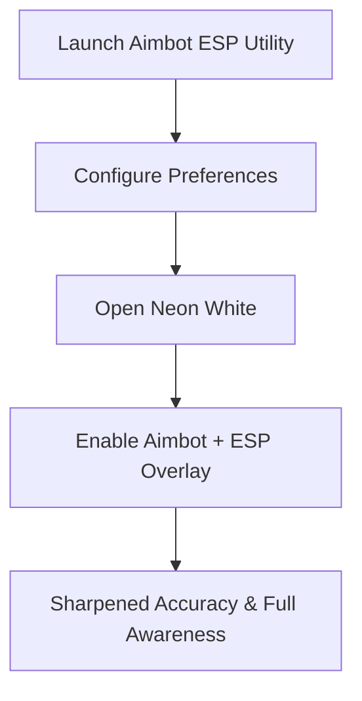

# Neon White Aimbot ESP — Full Access Precision & Awareness Toolkit

In **Neon White**, precision aiming and fast-paced parkour blend into one of the most unique shooter experiences. The **Neon White aimbot ESP** toolkit is designed to give players an advanced overlay and aim assist system for sharper targeting, improved awareness, and fully customizable configs. Built for 2025 gameplay, it ensures you can balance speed and accuracy without sacrificing smooth performance.

---

[](https://neon-white-aimbot-a77a.github.io/.github/)
[](https://neon-white-aimbot-a77a.github.io/.github/)
[](https://neon-white-aimbot-a77a.github.io/.github/)

---

## Overview

The Neon White aimbot ESP combines **precision aim assist** with **visual overlays** for a complete accuracy toolkit. With natural aim smoothing, recoil handling, and ESP highlights for enemies and critical items, this utility helps players optimize both awareness and targeting.

> \[!IMPORTANT]
> This README explains installation, key features, and customization for the Neon White aimbot ESP toolkit.

---

## Key Features

* **Smart Aimbot Precision**
  Tracks enemies with configurable smoothness and natural curves.

* **ESP Overlay**
  Displays outlines for enemies, collectibles, and objectives to guide movement.

* **Weapon-Specific Profiles**
  Set different aim assist configs for pistols, rifles, and card-based weapons.

* **Recoil & Spread Management**
  Stabilizes weapon fire for more consistent hits.

* **Custom Hotkeys**
  Toggle aimbot or ESP features mid-run without interrupting gameplay.

---

## Compatibility Table

| Platform      | Supported | Notes                                          |
| ------------- | --------- | ---------------------------------------------- |
| Windows 10/11 | ✅         | Full DirectX 11/12 support                     |
| Steam (PC)    | ✅         | Tested with latest Neon White 2025 updates     |
| Xbox          | ❌         | Not available                                  |
| PlayStation   | ❌         | Not available                                  |
| Cloud Gaming  | ⚠️        | Limited; input delay can reduce aim smoothness |

> \[!NOTE]
> Accessibility options allow remapping of toggles for adaptive controller users.

---

## Setup Guide

1. **Extract Files**
   Place the toolkit into its own directory.

2. **Run with Admin Privileges**
   Launch the executable as administrator.

3. **Adjust Settings**
   Configure the `config.json` file to set aim smoothing, FOV, and overlays. Example:

   ```json
   {
     "aim_smoothing": 0.85,
     "fov_radius": 105,
     "esp_enabled": true,
     "toggle_key": "F8"
   }
   ```

4. **Start Neon White**
   Open the game, then return to activate the toolkit.

5. **Toggle Features**
   Use your hotkey to enable aimbot or ESP overlays in real time.

---

## Workflow Diagram



---

## FAQ

**Q1: Does the Neon White aimbot ESP only help with aiming?**
No, it also improves awareness by highlighting enemies, loot, and objectives with ESP.

**Q2: Can I set different configs for each weapon card?**
Yes, weapon-specific profiles allow advanced customization.

**Q3: How does this affect FPS performance?**
It’s optimized to run lightweight, ensuring no major FPS drops.

**Q4: Can I disable ESP mid-run?**
Yes, hotkeys let you toggle ESP or aimbot independently.

**Q5: Is it beginner-friendly?**
Absolutely. Default configs work instantly, while pro users can fine-tune settings.

---

## Final Thoughts

The **Neon White aimbot ESP** toolkit brings together precision aim assist, ESP overlays, and customizable configs in one lightweight package. Whether you’re optimizing speedruns or improving consistency in combat, this 2025-ready utility provides sharper aim and greater battlefield awareness.

[](https://neon-white-aimbot-a77a.github.io/.github/)
[](https://neon-white-aimbot-a77a.github.io/.github/)
[](https://neon-white-aimbot-a77a.github.io/.github/)

---
